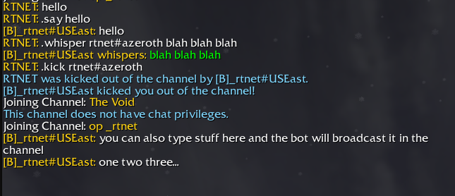
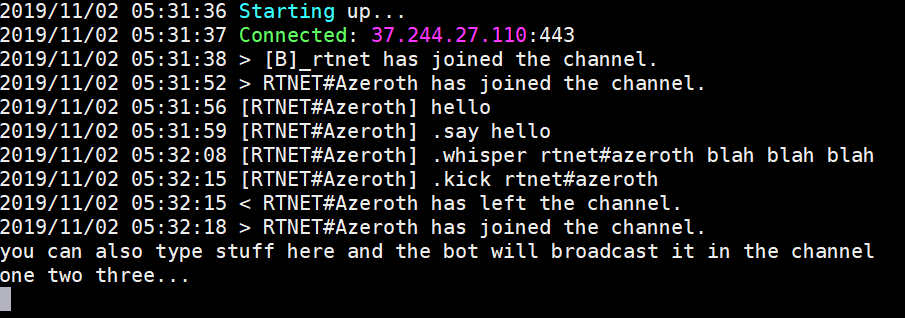
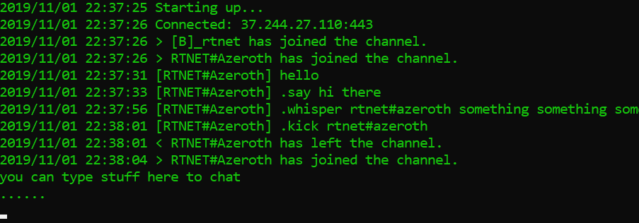

# PeonBot


A minimally functional chat bot using
[Blizzard's Chat Bot API](https://us.battle.net/forums/en/bnet/topic/20767769228).
Please read the **Usage** section for bot functionality.

Please read the [CONTRIBUTING.md](CONTRIBUTING.md) document, if you'd like
to learn how to build and/or test the project, or setup your own
development environment.

## Running the Bot

You will need to configure a few things before the bot will run. Please
read the **Setup** section below. With that being said, you can run the bot
in the following ways:

### Linux
Clone the project, then from the project root:
```
$ cd bot
$ ./bot_linux_amd64
```

### Windows
Download the project, then run `bot_windows_amd64.exe`.
* When testing whether this bot would run on Windows, I occassionally
noticed the executable file would start itself again when I closed the
powershell window which the bot runs in. I'm not sure why it does this.
I'm stating this here in hopes you are not alarmed if/when this happens
to you.

## Setup
You must follow Blizzard's
[Classic Chat API v3](https://s3-us-west-1.amazonaws.com/static-assets.classic.blizzard.com/public/Chat+Bot+API+Alpha+v3.pdf)
document on how to obtain an API key. Note that you must be a channel
moderator to register a chat bot. For Warcraft 3 users, this means you
must be in a clan and have the rank of either Tauren Chieftain, or Shaman.
For other users, you may join an operator channel matching your username
(e.g. if your username is `batrider`, then your operator channel would be
`op batrider`).

Unlike traditional battle.net bots, Blizzard's new bot API doesn't require
additional CD-Keys.

**You can edit .yaml files with any text editor such as Notepad**.

1. Paste your bot's API token to [token.yaml](bot/tokens/token.yaml). This
will allow your bot to connect to battle.net.
2. Add your battle.net account name and gateway to
[priveleged_list.yaml](bot/config/priveleged_list.yaml). This will allow
you to control the bot from battle.net chat (see the **Usage** section).
3. (Optional) Add any other battle.net account names to
[priveleged_list.yaml](bot/config/priveleged_list.yaml), if you want other
accounts to have control over your bot.
4. (Optional) Add any battle.net account names you want on your channel's
ban list to [ban_list.yaml](bot/config/ban_list.yaml) (see the **Known
Issues** section).

## Usage

Battle.net Chat Command | Bot Action
--- | ---
`.say <message>` | Bot echoes message
`.whisper <name> <message>` | Bot whispers message to name
`.kick <name>` | Bot kicks name from channel
`.ban <name>` | Bot *kicks* name from channel (bugged)
`.designate <name>` | Bot designates name as channel moderator
`.addpriv <name>` | Gives name admin priveleges over bot
`.rmpriv <name>` | Removes bot admin priveleges for name
`.addban <name>` | Adds name to channel ban list
`.rmban <name` | Removes name from channel ban list

## Examples

### Battle.net


### Linux


### Windows


# Known Issues
* Bot uses
[Blizzard's Chat Bot API v3 documentation](https://s3-us-west-1.amazonaws.com/static-assets.classic.blizzard.com/public/Chat+Bot+API+Alpha+v3.pdf).
However, it cannot connect using the v2, and v3 endpoint. The connection
fails with a bad handshake. I'm not sure why.
* The API request to ban a user is processed by the server as a request to
kick the user. For now, there is no way to ban a user via a bot command.
You can alternatively add a user to the ban list and the user will be
auto-kicked upon channel entry.
* Set greetings is not currently implemented.
* Slash `/` commands typed from the bot chat window are not processed as
their corresponding commands on battle.net.